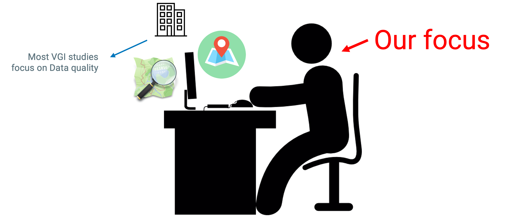
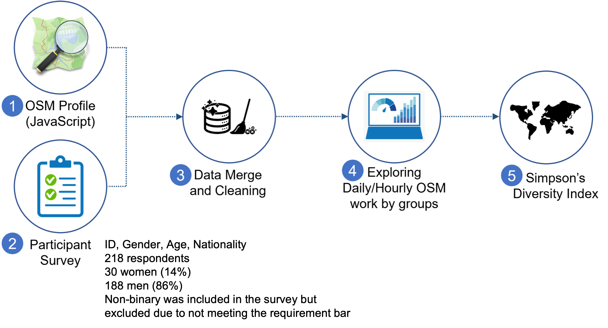
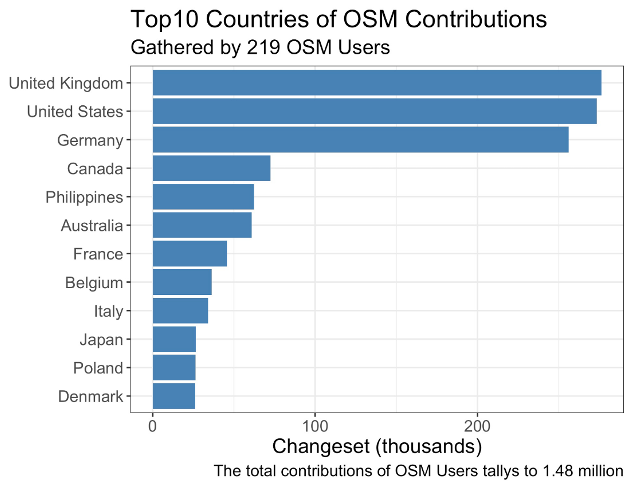
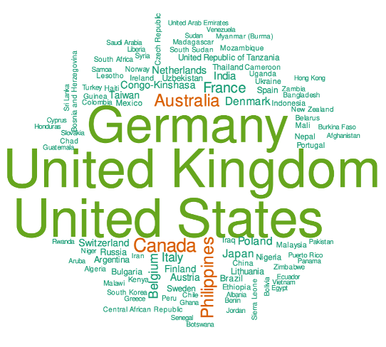
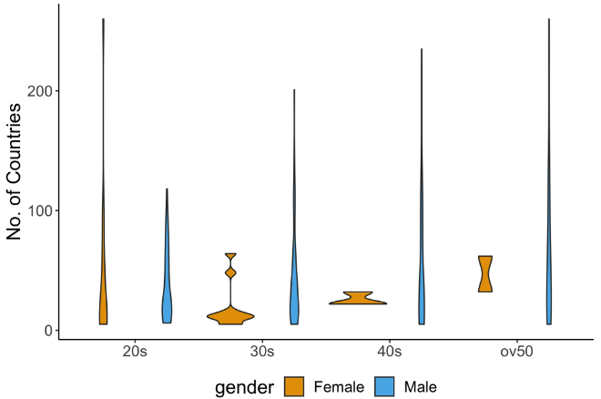
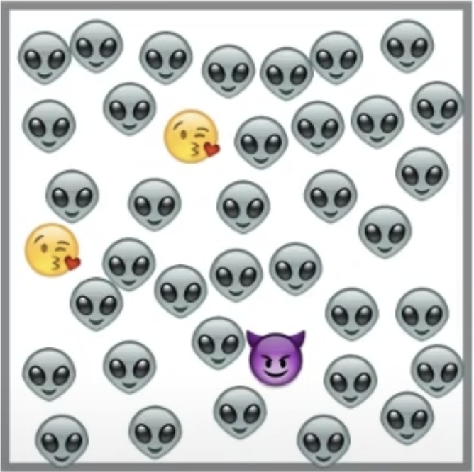
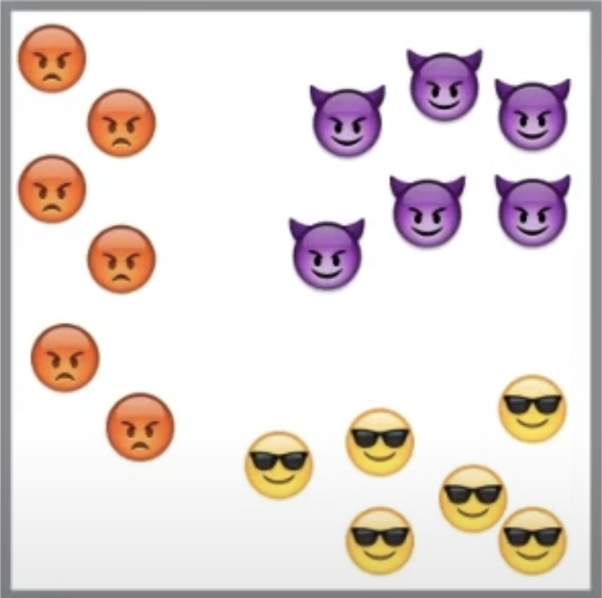
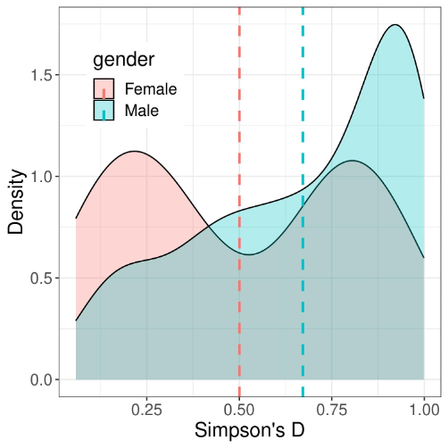
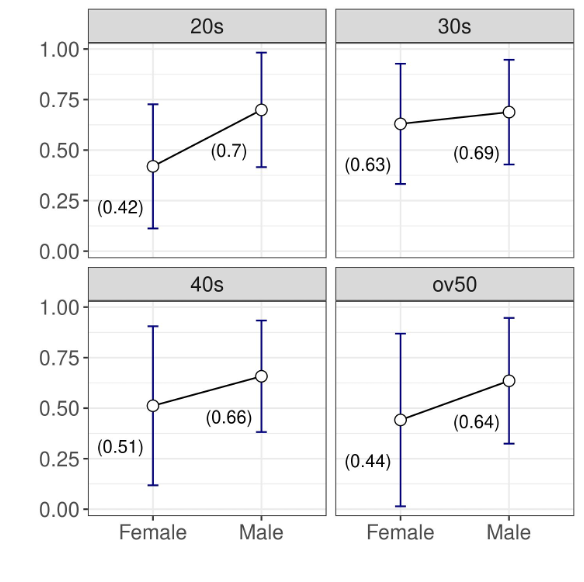

```{r setup, include=FALSE}
library(flexdashboard)
library(tidyverse)
library(purrr)
library(magrittr)
library(cowplot)
library(vegan)
library(hrbrthemes)
library(maps)
library(wordcloud)
library(plotly)
library(leaflet)
library(sf)
library(rnaturalearth)
library(gt)
options(scipen = 9999)
```

## Our Main Findings
- No.of Contributed Countries: Women were remarkably lower than that of men
- However, such variabilities was identified by the disaggregation of gender and age
    * Men between 20s-50s & Women in 20s
- Men were more likely to be spatial diverse than their female counterparts: **M: .67, W: .50**
- However, this once again varied significantly by the age groups.

### Why are We Doing This Research?
#### Crowdsourced Data: Patchy Distribution Across Space & Time
* A well-known feature of the data from citizen science projects is the patchy distribution of maps across space and time
* This leaves global citizen science datasets with spatial and temporal gaps and redundancies

#### Understanding the crowd's temporal patterns and their spatial preferences is imperative 
* Contributors' daily volunteering routines and preferences can reveal habits and interests
* Can assist app designers and software engineers to create more inclusive crowdsourcing platforms

#### Our Focus




### Participants Profile and the Flow Chart
#### Participant Summary
|   Age   | Female | Male | Age Subtotal |
|:--------:|:------:|:----:|:------------:|
|   20s    |   15   |  41  |      56      |
|   30s    |   10   |  62  |      73      |
|   40s    |   3    |  45  |      48      |
| Over 50s |   2    |  41  |      43      |
| Subtotal | 30     | 189  | 219 |


#### Flow Chart




<!----------------------------------------------------------->
### Exploratory Findings | Top three countries accounted for 60% of the total contribution

{.absolute top="200" left="0" width="500" height="400"} {.absolute top="220" left="600" width="400" height="350"}

<br>


{.absolute top="200" left="-30" width="500" height="350"}

- Long-tail distribution: Men and women in 20s
- Women > 30s: Fewer than 100 contributed countries
- **Oversampling?**: OSM, in general, might have a similar distribution

### Simpson's Index of Diversity: The Metrics

#### Probability that any two randomly selected countries from the sample will be different

[$D' = 1 - (\sum n(n-1)/N(N-1))$]{style="font-size:20px"}

-   **N**: Total number of contributions (by user)
-   **n**: Number of contributions at particular country (by user)
-   Defined at individual level and then aggregated by gender and age

#### How should I understand the numbers?

-   0: Low diversity (tends to be domestic)
-   1: High diversity

#### Simpson's Index of Diversity: Quick Example

{.absolute top="200" left="50" width="350"
height="350"} {.absolute top="200" left="50"
width="350" height="350"}

$D' = 1 - (\sum n(n-1)/N(N-1))$     $D' = 1 - (\sum n(n-1)/N(N-1))$\
$D' = 1 - (\frac{36(36-1)+2(2-1)+1(1-1)} {39(39-1)})$      
$D' = 1 - (\frac{6(6-1)+6(6-1)+6(6-1)} {18(18-1)})$ <br>
$D' = 1 - (\frac{1282}{1482})$           $D' = 1 - (\frac{90}{306})$
<br> $1 - 0.85$                 $1 - 0.29$ <br> $0.15$                  
$0.71$ <br>

[*15% chance of randomly picking 2 that are
different*]{style="color:blue"}   [*71% chance of randomly picking 2
that are different*]{style="color:green"}

<!---------------------------------------------------------------->

### Simpson's Index of Diversity
#### Summary Chart


```{r}
simpson <- load("AAG_Journal.RData")

country_list %>% 
  purrr::map(pluck, 2) %>% 
  sapply(length) -> number_of_contributed_contries

country_list %>% 
  purrr::map(pluck, 2) %>% 
  sapply(sum) -> number_of_changesets


########################
#--Simpson's D index--##
########################

#--Using vegan package-##
# Simpson D
country_list %>% 
  purrr::map(pluck, 2) %>% 
  sapply(diversity, index = "simpson") -> simpson

simpson[simpson == 0] <- NA

#1 - simpson

#(1 - simpson) %>% mean(na.rm = T) # Simpson's Diversity overall mean
#sum(is.na((1 - simpson))) # Count how many NAs 

#########################
#--Simpson D by group -##
#########################

simpson_df <- tibble(
  usernames_df %>% select(gender, age)) %>%
  mutate(#id = 1:length(username),
    age_combined = case_when(age == "18-24" ~ "20s",
                             age == "25-29" ~ "20s",
                             age == "30-34" ~ "30s",
                             age == "35-39" ~ "30s",
                             age == "40-44" ~ "40s",
                             age == "45-49" ~ "40s",
                             age == "50-54" ~ "ov50",
                             age == "55-59" ~ "ov50",
                             age == "60-64" ~ "ov50",
                             age == "65-69" ~ "ov50",
                             age == ">70" ~ "ov50"),
    age_combined = factor(age_combined, levels = c("20s", "30s", "40s", "ov50")))


## Add Simpson D
simpson_df %>% 
  bind_cols(simpsonD = 1 - simpson,
            no_of_countries = number_of_contributed_contries,
            total_changesets = number_of_changesets) %>% 
  filter(no_of_countries >= 5) -> simpson_df1

simpson_df1 %>% 
  mutate(Age = age_combined) %>% 
  group_by(gender, Age) %>% 
  summarise(SimpsonD = mean(simpsonD, na.rm = T) %>% round(3),
            `No.of Countries (mean)` = mean(no_of_countries, na.rm = T)%>% round(0),
            `Total Changesets (mean)` = median(total_changesets, na.rm = T)%>% round(0)) %>% 
  gt()

```


#### Figures
{.absolute top="150" left="-30" width="500" height="480"}

- SID: Female: 0.50 Male: 0.67
- Male participants were likely contribute to more countries than their female counterparts.
- However, two peaks of diversity patterns of the female users mean that the spatial preference within the group contrasts significantly


{.absolute top="100" left="-30" width="500" height="480"}

- Male participants have systematically scored higher diversity measures across both age groups
- The scores of female participants are constantly lower than that of males, and it <span style="color:blue">*varies significantly by age groups*</span>
- Female 40-50s’ have wider variation due to small number of participants

